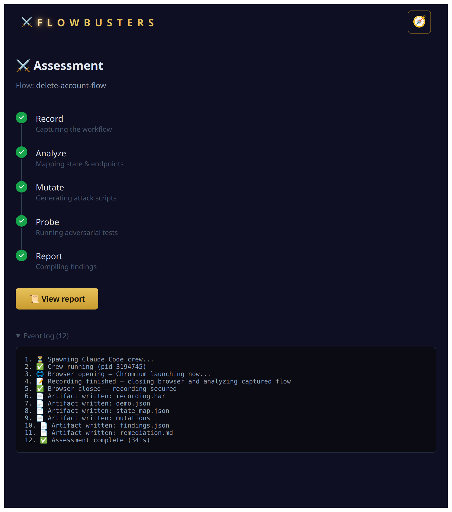

<p align="center">
  
</p>

# FlowBusters

**AI-assisted business logic testing from one recorded browser workflow.**

FlowBusters records a legitimate workflow in a real browser, analyzes the
captured interactions and HTTP traffic, generates adversarial business logic
tests, executes them against the authorized target, and produces
evidence-backed findings.

> [!IMPORTANT]
> ### Experimental MVP / Proof of Concept
> FlowBusters is an active research prototype. It is **not production-ready** and
> should not be treated as a hardened security platform.
>
> **Authorized testing only. Use only against non-production applications you
> own or have explicit permission to test.**

---

## Why FlowBusters?

Traditional security tools are effective at testing individual endpoints and
known vulnerability patterns. Business logic flaws are different: they often
appear only when a user violates the sequence, roles, or assumptions built into
an application workflow.

Examples include:

- skipping required steps
- replaying completed actions
- accessing later stages directly
- using one role’s session against another role’s endpoint
- changing identifiers, prices, quantities, or application state
- repeating operations intended to run only once

These weaknesses are difficult to detect automatically because the tool must
first understand how the legitimate workflow is supposed to behave.

FlowBusters learns from a workflow you demonstrate, then explores ways that
workflow may be broken.

---

## How It Works

**Record → Analyze → Mutate → Probe → Report**

| Phase | Agent | What happens | Output |
|:---:|:---|:---|:---|
| **Record** | Recorder | Opens a headed Playwright browser while you perform the legitimate workflow | `demo.json`, `recording.har` |
| **Analyze** | Analyst | Reconstructs steps, roles, state transitions, and critical endpoints | `state_map.json` |
| **Mutate** | Saboteur | Generates adversarial HTTP probe scripts from the observed workflow | `mutations/*.py` |
| **Probe** | Prober | Executes each probe and classifies the result | `findings.json` |
| **Report** | Captain | Organizes confirmed findings, evidence, CWE mappings, and remediation | `remediation.md` |

Each phase must produce its expected artifacts before the next phase begins.
The Captain stops the assessment when a required gate fails.

> FlowBusters always uses a headed, user-driven browser during recording.
> There is currently no fully automated or headless recording mode.

---

## What It Is

FlowBusters is a self-service security testing portal built with FastAPI,
React, Playwright MCP, Claude Code, and deterministic HTTP probe scripts.

| Component | Responsibility |
|:---|:---|
| **React portal** | Starts assessments, displays live progress, and renders reports |
| **FastAPI backend** | Coordinates assessments, streams events, and manages artifacts |
| **Playwright recorder** | Captures browser interactions and network traffic |
| **Analyst** | Interprets the recording and builds the workflow state map |
| **Saboteur** | Proposes adversarial tests for the observed business rules |
| **Prober** | Executes generated HTTP tests and evaluates the responses |
| **Captain** | Coordinates phases, validates gates, and assembles the report |

---

## The Agent Model

The named agents are specialized roles inside one Claude Code session, not five
independent LLM processes.

| Role | Responsibility |
|:---|:---|
| **Captain** | Validates scope, sequences phases, checks gates, and assembles the report |
| **Recorder** | Drives the Playwright browser and captures the demonstrated workflow |
| **Analyst** | Reads the recording and identifies steps, roles, and critical endpoints |
| **Saboteur** | Generates target-specific adversarial probe scripts |
| **Prober** | Runs the scripts, interprets responses, and writes the findings |
| **FastAPI backend** | Provides deterministic orchestration and makes no security decisions |
| **Mutation scripts** | Execute deterministically after being generated by the Saboteur |

The files under `crew/` define the roles, procedures, gates, and allowed
behavior around the agentic workflow.

---

## Progress and Reporting

The portal displays each assessment phase and streams events from the backend
using Server-Sent Events.

<p align="center">
  
</p>

During recording, the user performs the normal workflow in Chromium. After
recording finishes, the remaining phases run without additional interaction.

The event log shows when:

- the browser opens
- recording begins and ends
- expected artifacts are created
- analysis and mutation complete
- individual probes run
- findings and remediation are written

---

## Attack Vectors

FlowBusters currently explores the following categories:

| Attack | Description |
|:---|:---|
| `SKIP_STEP` | Calls a later-stage endpoint without completing its prerequisites |
| `ROLE_SWAP` | Uses one role’s session against another role’s endpoint |
| `DATA_TAMPER` | Changes identifiers, amounts, statuses, or other request values |
| `MASS_ASSIGNMENT` | Adds privileged fields that the normal interface does not expose |
| `PRICING_TAMPER` | Submits zero, negative, or otherwise manipulated prices |
| `DOUBLE_SPEND` | Repeats an operation sequentially or concurrently |
| `REPLAY_ATTACK` | Reuses a request after it should have become invalid |
| `FORCED_BROWSING` | Calls an endpoint directly instead of following the expected UI flow |

The generated tests depend on the recorded application and are not limited to
fixed payload templates.

---

## Understanding the Artifacts

| File | Purpose |
|:---|:---|
| `demo.json` | Records what the user clicked and entered |
| `recording.har` | Contains the corresponding HTTP requests and responses |
| `state_map.json` | Describes the inferred workflow, roles, transitions, and attack surface |
| `mutations/*.py` | Contains one generated HTTP probe per proposed attack |
| `findings.json` | Stores probe results and confirmed findings |
| `remediation.md` | Provides CWE-mapped remediation for confirmed findings |

`demo.json` and `recording.har` provide two views of the same workflow: user
interactions and the network operations triggered by those interactions.

The Analyst derives `state_map.json` from both sources.

---

## Probe Outcomes

Each executed probe receives one of three outcomes:

| Outcome | Meaning |
|:---|:---|
| `BUG_FOUND` | The application accepted an operation that should have been rejected |
| `REJECTED` | The application correctly blocked the attempted operation |
| `ERROR` | The test could not execute or its result could not be evaluated |

A successful HTTP response does not automatically prove a vulnerability.
Generated tests and their evidence still require human review.

`remediation.md` is created only when at least one `BUG_FOUND` result exists.

---

## Quickstart

### Prerequisites

Install the following before running FlowBusters:

- Python 3
- Node.js and npm
- Google Chrome
- Claude Code CLI
- an Anthropic API key

### 1. Clone the repository

```bash
git clone https://github.com/allmighty-tiger/FlowBusters.git
cd FlowBusters
```

### 2. Configure the application

Copy the example environment file:

```bash
cp .env.example .env
```

Open `.env` and provide your Anthropic API key:

```env
ANTHROPIC_API_KEY=<your-anthropic-api-key>
ANTHROPIC_MODEL=claude-sonnet-5
```

Install the root Node dependency used by Playwright MCP:

```bash
npm install
```

Copy the MCP configuration:

```bash
cp mcp.json.example mcp.json
```

Update the `command` value in `mcp.json` so it points to the installed
`playwright-mcp` executable.

Example for macOS or Linux:

```json
{
  "mcpServers": {
    "playwright": {
      "command": "<repo-root>/node_modules/.bin/playwright-mcp",
      "args": ["--browser", "chrome", "--ignore-https-errors"]
    }
  }
}
```

On Windows, the executable may be:

```text
<repo-root>\node_modules\.bin\playwright-mcp.cmd
```

Replace `<repo-root>` with the absolute path to your local FlowBusters
repository.

### 3. Start the backend

Create and activate a Python virtual environment.

macOS or Linux:

```bash
python3 -m venv .venv
source .venv/bin/activate
```

Windows PowerShell:

```powershell
python -m venv .venv
.\.venv\Scripts\Activate.ps1
```

Install the backend dependencies:

```bash
pip install -r backend/requirements.txt
```

The backend attempts to load `.env` through `python-dotenv`. Install it if you
want values from `.env` to be loaded automatically:

```bash
pip install python-dotenv
```

Start FastAPI from the repository root:

```bash
uvicorn backend.api.main:app --port 8000
```

Do not use `--reload` during an assessment. Reloading the backend can terminate
the active crew process.

### 4. Start the frontend

Open another terminal:

```bash
cd frontend
npm install
npm run dev
```

Open:

```text
http://localhost:3000
```

### 5. Run an assessment

In the portal:

1. Enter an authorized target URL.
2. Select **Start Assessment**.
3. Complete the legitimate workflow in the opened Chromium browser.
4. Select **Finish recording**.
5. Wait for Analyze, Mutate, Probe, and Report to complete.
6. Review the generated findings and supporting evidence.

---

## Configuration

| Variable | Purpose | Default |
|:---|:---|:---|
| `ANTHROPIC_API_KEY` | Anthropic API credentials | none |
| `ANTHROPIC_MODEL` | Model used by the crew | `claude-sonnet-5` |
| `CREW_EFFORT` | Claude Code reasoning effort | `medium` |
| `CORS_ORIGINS` | Allowed frontend origins | `http://localhost:3000` |
| `ARTIFACTS_DIR` | Root directory for generated assessment artifacts | `.` |
| `CLAUDE_CODE_BIN` | Claude Code executable | `claude` |
| `PHASE_TIMEOUT` | Per-phase timeout in seconds | `600` |
| `ASSESSMENT_TIMEOUT` | Overall timeout in seconds | `1800` |
| `MCP_CONFIG_PATH` | Path to the Playwright MCP configuration | `./mcp.json` |
| `CREW_DIR` | Path to the crew definitions | `./crew` |

---

## Generated Files

Assessment artifacts are stored by flow name:

```text
runs/{flow-name}/
├── flows/
│   ├── demo.json
│   ├── recording.har
│   └── state_map.json
├── mutations/
│   ├── 01_*.py
│   └── ...
└── reports/
    ├── findings.json
    └── remediation.md
```

Flow names use kebab case, such as `checkout-flow`. If no name is supplied,
FlowBusters uses `default`.

The `findings.json` summary includes:

```json
{
  "bugs_found": 0,
  "critical_findings": 0,
  "rejected": 0,
  "errors": 0
}
```

Each confirmed finding can include:

- severity
- CWE references
- request and response evidence
- result classification
- finding source
- recommended remediation

---

## Safety and Trust Boundaries

FlowBusters executes AI-generated Python probe scripts against a live target.
Those scripts can send state-changing requests, replay authenticated sessions,
modify application data, and trigger real business operations.

**This is inherently risky.**

> **FlowBusters is an experimental offensive-security prototype, not a hardened
> or sandboxed execution platform. Run it only in an isolated environment
> against an explicitly authorized, non-production target.**

### Critical security limitations

- Claude Code currently runs with `--dangerously-skip-permissions`.
- Generated mutation scripts execute with the permissions of the local
  FlowBusters process.
- Probe restrictions are defined through agent instructions; they are not
  enforced by an operating-system sandbox.
- `scope.json` is evaluated by the agent workflow. It is a guardrail, not a
  security boundary and not a substitute for network-level access controls.
- A generated probe may behave differently from what its description claims.
- HAR files can contain session cookies, authorization headers, access tokens,
  personal data, and complete request and response bodies.
- Generated scripts and reports may reproduce sensitive values captured during
  recording.
- A defect, prompt injection, model error, or malicious target response could
  influence generated code or assessment behavior.

**Do not rely on FlowBusters to contain its own actions.** The operator is
responsible for creating external boundaries around the tool.

This is not a minor implementation detail: FlowBusters currently executes
AI-generated code without a hard sandbox and must be treated as an untrusted
code-execution system. Do not run it on a workstation or network where a
compromised, incorrect, or over-broad probe could reach sensitive systems,
credentials, or data.

### Required operating precautions

Before running an assessment:

1. Obtain explicit written authorization for the exact target and test activity.
2. Use a dedicated QA, staging, or intentionally vulnerable environment.
3. Use disposable test accounts and synthetic data.
4. Run FlowBusters inside a disposable VM, container, or similarly isolated
   environment.
5. Restrict network access so the execution environment can reach only the
   approved target and required API services.
6. Use the least-privileged credentials necessary for the demonstrated workflow.
7. Review `scope.json`, the target URL, and all configured paths before starting.
8. Do not expose production credentials, cloud credentials, SSH keys,
   source-code tokens, or unrelated secrets to the FlowBusters process.
9. Review generated files under `mutations/` before allowing probes to execute
   against any sensitive target.
10. Ensure the target can be restored if a probe creates, modifies, duplicates,
    or deletes application state.

After an assessment:

- Treat `recording.har`, `demo.json`, generated probes, findings, and reports as
  sensitive security artifacts.
- Remove or redact cookies, tokens, credentials, and personal information before
  sharing any artifact.
- Revoke or rotate temporary credentials and sessions used during testing.
- Store retained artifacts in an access-controlled location.
- Delete assessment data that is no longer required.
- Confirm that the target was not left with unintended test data or state changes.

### Scope configuration

When `scope.json` is present, the Captain checks the target against:

- `allowed_domains`
- `allowed_paths_prefix`
- `block_production`

This check can reduce accidental misuse, but it does not provide hard isolation.
It can fail, be misconfigured, or be bypassed by behavior outside the intended
agent workflow.

Enforce scope independently through network segmentation, firewall or proxy
rules, dedicated credentials, and target-side access controls.

### Prohibited use

Do not use FlowBusters:

- against any system without explicit authorization
- against production merely because `scope.json` permits it
- from a workstation containing valuable credentials or unrestricted corporate
  network access
- with real customer, employee, payment, health, or other sensitive data
- as an unattended autonomous scanner
- when generated code cannot be inspected and the target cannot be safely
  restored

Stopping the backend does not guarantee that every external side effect has been
reversed. The safest assumption is that any executed probe may have changed the
target.

---

## Current Limitations

- FlowBusters learns from one demonstrated workflow at a time.
- Results depend on the completeness and quality of the recording.
- Authentication and application state may require manual handling.
- Complex multi-user and asynchronous workflows may not be reconstructed fully.
- Generated tests can contain false positives, invalid assumptions, or
  incomplete validation.
- A `200` response alone does not prove that an operation succeeded.
- Probe restrictions are instruction-level and are not enforced by a dedicated
  sandbox.
- The MVP has not been designed or hardened for production deployment.
- FlowBusters does not replace manual penetration testing, threat modeling, code
  review, or conventional security scanning.

---

# Responsible Use

> **AUTHORIZED TESTING ONLY**
>
> **FlowBusters is an offensive-security research project intended exclusively
> for authorized testing.**
>
> **Do not use it against any application, account, network, or environment
> unless you own the system or have explicit permission to test it.**

You are responsible for:

- obtaining explicit permission before testing
- defining and enforcing the authorized scope
- protecting captured traffic, credentials, tokens, and application data
- reviewing generated probes before execution
- monitoring the assessment and its effects
- complying with applicable laws, contracts, organizational policies, and rules
  of engagement
- restoring or cleaning the target after testing
- securely deleting or retaining generated artifacts

The presence of technical access, a publicly reachable endpoint, or a permissive
`scope.json` configuration does not constitute authorization.

**The project’s safeguards do not transfer responsibility from the operator.
You remain responsible for every request executed through FlowBusters and every
effect it has on the target.**

<p align="center">
  <sub>FlowBusters — record a workflow, break its rules, get the fix.</sub>
</p>
