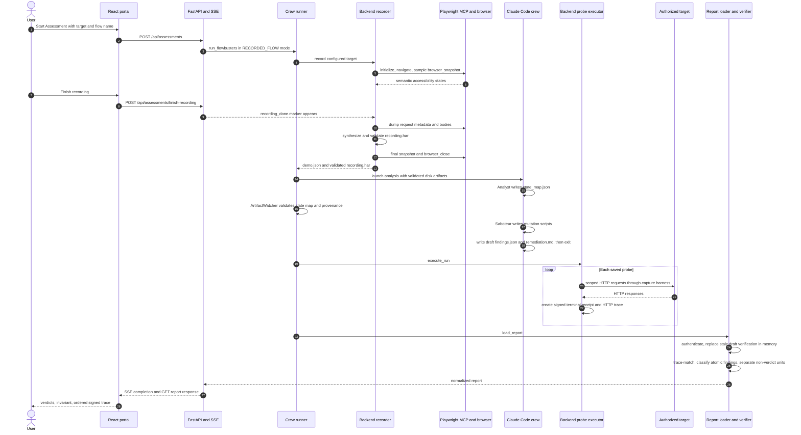
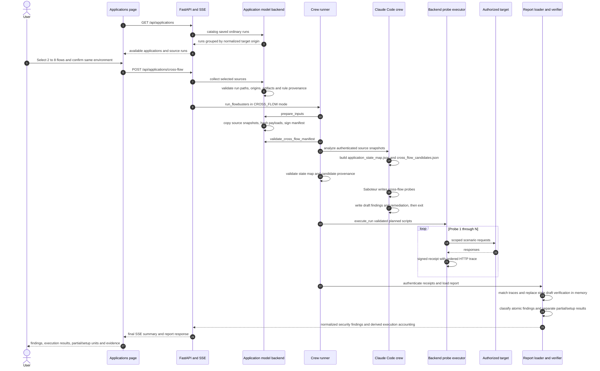

# FlowBusters technical architecture

## System purpose

FlowBusters records an authorized business workflow, asks an AI crew to model its states and propose adversarial scenarios, executes the resulting probes under backend ownership, and derives report verdicts from authenticated HTTP evidence rather than from the AI's claims. It also combines two to eight compatible recorded flows to identify interactions that no single recording exercised. The implementation is intentionally evidence-oriented: agent output is a hypothesis or draft until backend receipt authentication, trace matching, invariant evaluation, provenance validation, and report normalization succeed. ([`backend/runtime/orchestrator.py` — `run_flowbusters`](../backend/runtime/orchestrator.py), [`backend/runtime/crew_runner.py` — `run_crew`](../backend/runtime/crew_runner.py), [`backend/runtime/probe_executor.py` — `execute`, `reconcile`](../backend/runtime/probe_executor.py), [`backend/runtime/verification.py` — `load_report`, `normalize_report`](../backend/runtime/verification.py))

## Component map

| Component | Current responsibility | Implementation reference |
|---|---|---|
| React frontend | Starts recorded assessments, lists/selects source runs for cross-flow analysis, consumes SSE progress, requests normalized reports, and renders evidence and verdicts. | [`frontend/src/pages/portal.tsx` — `PortalPage`, `handleSubmit`](../frontend/src/pages/portal.tsx); [`frontend/src/pages/applications.tsx` — `ApplicationsPage`, `start`](../frontend/src/pages/applications.tsx); [`frontend/src/pages/progress.tsx` — `ProgressPage`](../frontend/src/pages/progress.tsx); [`frontend/src/pages/report.tsx` — `ReportPage`](../frontend/src/pages/report.tsx) |
| FastAPI API and SSE | Enforces one active assessment per process, starts both run modes, fans `ProgressEvent` objects out to subscribers, keeps a 100-event replay buffer, and serves normalized reports. | [`backend/api/main.py` — `start_assessment`, `start_cross_flow`, `_broadcast`, `stream_progress`, `get_report`](../backend/api/main.py) |
| Orchestrator | Converts API arguments into `CrewConfig`, assigns `RECORDED_FLOW` or `CROSS_FLOW`, invokes the crew runner, and returns findings/remediation in the legacy-compatible result shape. | [`backend/runtime/orchestrator.py` — `RunMode`, `ProgressEvent`, `run_flowbusters`](../backend/runtime/orchestrator.py) |
| Recorder and Playwright MCP | The backend starts a stdio Playwright MCP server without the Anthropic key, opens the target, samples accessibility snapshots, dumps request details and bodies, synthesizes HAR, writes `demo.json`, closes the browser, and marks the recording validated. | [`backend/runtime/recorder.py` — `record`, `optional_snapshot`, `compact_snapshot`, `add_ui_state`, `dump_capture`](../backend/runtime/recorder.py) |
| AI crew / Analyst | One Claude Code subprocess reads the validated recording or authenticated cross-flow snapshots. The Analyst creates a schema-v2 state map with transitions, roles, endpoints, semantic capture metadata, and structured observed-UI rules. | [`backend/runtime/crew_runner.py` — `build_system_prompt`, `run_crew`](../backend/runtime/crew_runner.py); [`crew/agents/analyst/charter.md` — Analyst process and output contract](../crew/agents/analyst/charter.md); [`crew/skills/analyze-har/OBSERVED_UI_RULES.md` — structured rule contract](../crew/skills/analyze-har/OBSERVED_UI_RULES.md) |
| Application model / cross-flow analysis | Catalogs ordinary runs by target origin, loads two to eight source runs, hashes their data, copies immutable snapshots into the new run, signs the source manifest, and gates agent-authored cross-flow candidates against those sources. The AI produces the application model and candidate hypotheses; the backend authenticates their inputs and references. | [`backend/runtime/application_model.py` — `catalog`, `collect`, `prepare_inputs`, `validate_cross_flow_candidates`](../backend/runtime/application_model.py); [`backend/runtime/ui_provenance.py` — `validate_cross_flow_manifest`, `_verify_cross_flow_snapshot`](../backend/runtime/ui_provenance.py) |
| Saboteur | Reads the state map and authors 5–8 self-contained mutation scripts. Generated HTTPX captures copy the transport sequence assigned by the backend harness, represent setup/reset traffic separately, and use a supported response-root invariant or explicitly declare an unsupported business-rule predicate. It does not own execution. | [`crew/agents/saboteur/charter.md` — Saboteur process and constraints](../crew/agents/saboteur/charter.md); [`crew/skills/mutate-flow/SKILL.md` — mutation workflow](../crew/skills/mutate-flow/SKILL.md); [`crew/skills/probe-flow/EXECUTION.md` — execution-output contract](../crew/skills/probe-flow/EXECUTION.md) |
| Agent report authoring | Before execution, the AI crew writes `findings.json` and `remediation.md` as drafts. The runtime prompt explicitly forbids the crew from executing probes and tells it to leave verification to backend-owned execution. | [`backend/runtime/crew_runner.py` — `run_crew`](../backend/runtime/crew_runner.py); [`crew/agents/prober/charter.md` — report shape, superseded at runtime for execution ownership](../crew/agents/prober/charter.md) |
| Backend probe executor | Performs a conservative static contract preflight, copies each saved script to a temporary snapshot, executes it once through the capture harness, records a terminal receipt, then validates parsed output against the signed transport. A contract-invalid terminal receipt is retained and remaining generated probes are not started. | [`backend/runtime/probe_executor.py` — `preflight_script_contract`, `execute`, `validate_probe_output`, `execute_run`](../backend/runtime/probe_executor.py) |
| HTTP capture harness | Intercepts in-process HTTPX, Requests, and urllib calls, enforces `scope.json`, assigns one monotonic transport sequence to every request, exposes that sequence on the returned response, records ordered requests/responses to temporary JSONL, and rejects subprocess-based HTTP transports. It explicitly is not an operating-system sandbox for hostile Python. | [`backend/runtime/probe_capture.py` — `main`](../backend/runtime/probe_capture.py) |
| Signed execution receipts | Stores an append-only JSON receipt per execution containing the script snapshot/hash, command, timestamps, exit code, exact stdout/stderr, parsed JSON result, captured HTTP trace, backend contract-validation result, error, and an HMAC signature. Invalid signatures are ignored during loading. This is a local pipeline-integrity mechanism, not third-party attestation. | [`backend/runtime/probe_executor.py` — `key_for`, `execute`, `validate_probe_output`, `load_receipts`](../backend/runtime/probe_executor.py) |
| Backend-controlled business requirements | Loads a repository-owned, versioned registry, validates every record, required exact-run allowlist, origin and supported predicate, and attaches a rule only when all three scope checks match. The trusted run ID comes from the canonical backend report path; agent-supplied run IDs, flags, or copied requirement objects are discarded. | [`backend/runtime/business_requirements.json`](../backend/runtime/business_requirements.json); [`backend/runtime/business_requirements.py` — `load_business_requirements`, `trusted_report_run_id`, `apply_backend_requirements`](../backend/runtime/business_requirements.py) |
| Verifier | Matches claimed before/actions/after captures to the signed trace, verifies attribution and ordering, rejects omitted state-changing requests, resolves supported numeric invariants, validates observed-UI provenance, and applies verdict precedence. | [`backend/runtime/probe_executor.py` — `normalize_response`, `resolve_numeric_path`, `trace_error`, `reconcile`](../backend/runtime/probe_executor.py); [`backend/runtime/verification.py` — `classify`, `_classify_business_rule`](../backend/runtime/verification.py) |
| Report loader and UI | Joins artifacts by stable IDs, authenticates receipts, replaces stale pre-execution verification only in the normalized view, creates one primary atomic security finding per probe, separates partial coverage and setup-path-centered executions, and derives independent finding/execution counts. The UI renders each category separately. | [`backend/runtime/probe_executor.py` — `_is_stale_unexecuted_draft`, `_partial_coverage_for`, `reconcile`](../backend/runtime/probe_executor.py); [`backend/runtime/verification.py` — `load_report`, `_is_setup_path_centered`, `_collapse_duplicate_findings`, `normalize_report`](../backend/runtime/verification.py); [`backend/api/main.py` — `get_report`, `list_reports`](../backend/api/main.py); [`frontend/src/components/ReportView.tsx` — `ReportView`, `invariantFor`, `traceViews`, `remediationFor`](../frontend/src/components/ReportView.tsx) |

The Captain, Analyst, Saboteur, and Prober labels describe roles within one Claude Code subprocess, not separate services. Recording is currently backend-owned and completes before that subprocess starts its analysis work. ([`backend/runtime/crew_runner.py` — `build_system_prompt`, `run_crew`](../backend/runtime/crew_runner.py))

## Recorded single-flow assessment



Diagram references: [`frontend/src/pages/portal.tsx` — `PortalPage.handleSubmit`](../frontend/src/pages/portal.tsx), [`backend/api/main.py` — `start_assessment`, `finish_recording`, `stream_progress`, `get_report`](../backend/api/main.py), [`backend/runtime/recorder.py` — `record`, `dump_capture`](../backend/runtime/recorder.py), [`backend/runtime/crew_runner.py` — `run_crew`, `ArtifactWatcher.check`](../backend/runtime/crew_runner.py), [`backend/runtime/probe_executor.py` — `execute_run`, `execute`](../backend/runtime/probe_executor.py), and [`backend/runtime/verification.py` — `load_report`](../backend/runtime/verification.py).

### Recorded-flow phases and failure behavior

| Phase | Input | Output | Owner | Trust and validation | Failure behavior | Source |
|---|---|---|---|---|---|---|
| Start / prepare | Target URL, flow name, root `scope.json`, crew configuration | `runs/{flow}/` working tree, copied crew files, run-scoped `scope.json` | Backend | Flow name/scope are checked before navigation; configured setup paths are merged into the copied scope. | Existing finish evidence, invalid scope, blocked production, or an out-of-scope target stops recording before analysis. | [`backend/runtime/crew_runner.py` — `prepare_run_dir`](../backend/runtime/crew_runner.py); [`backend/runtime/recorder.py` — `check_scope`, `record`](../backend/runtime/recorder.py) |
| Record | Authorized user interaction in the Playwright-controlled browser | `flows/{flow}/demo.json`, `recording.har`, raw `har_data/`, validation markers | Backend recorder + Playwright MCP | Backend-captured source evidence is trusted as recording input, not as proof that a later adversarial probe ran. HAR synthesis checks entry count/body availability; `validate_har` checks HAR 1.2 structure. | Missing required MCP tools, lost browser, missing request details/bodies, invalid HAR, or timeout produces `RecordingError`; the AI subprocess is not launched. Some detached response bodies are tolerated only within the bounded rule in `dump_capture`. | [`backend/runtime/recorder.py` — `record`, `dump_capture`](../backend/runtime/recorder.py); [`backend/runtime/crew_runner.py` — `validate_har`, `run_crew`](../backend/runtime/crew_runner.py) |
| Analyze | Validated `demo.json`, `recording.har`, copied scope and Analyst instructions | `flows/{flow}/state_map.json` | AI Analyst | The whole map is an agent interpretation. For new runs, `ArtifactWatcher` calls the strict schema/provenance gate: schema versions, transition types/statuses, semantic step references, roles, endpoints, capture count, rule IDs, fact IDs, and exact raw pointers are validated. Only validated facts gain verified provenance. | An invalid in-progress map is reported and may be corrected until timeout; an invalid final map fails the assessment. | [`crew/agents/analyst/charter.md` — Process and Verification Gate](../crew/agents/analyst/charter.md); [`backend/runtime/crew_runner.py` — `ArtifactWatcher.check`, `run_crew`](../backend/runtime/crew_runner.py); [`backend/runtime/ui_provenance.py` — `validate_state_map`](../backend/runtime/ui_provenance.py) |
| Mutate | Validated state map, endpoints, roles, UI-rule references and scope | `mutations/{flow}/*.py` | AI Saboteur | Scripts are untrusted executable inputs. Agent instructions require syntax checking and a structured execution contract. After at least three scripts exist, `ArtifactWatcher.check` runs conservative static contract checks such as rejecting a literal `business_rule_must_hold` verification without an invariant before accepting the mutation phase. | Missing scripts cause the mutation phase timeout. A statically detectable contract defect keeps the phase open and asks the agent for a corrected file. Dynamic defects are caught from the first terminal receipt, which is preserved before remaining probes are stopped. Scripts are never evidence by themselves. | [`crew/agents/saboteur/charter.md` — Process and Verification Gate](../crew/agents/saboteur/charter.md); [`backend/runtime/crew_runner.py` — `ProbeContractError`, `ArtifactWatcher.check`, `run_crew`](../backend/runtime/crew_runner.py); [`backend/runtime/probe_executor.py` — `preflight_script_contract`, `validate_probe_output`, `execute_run`](../backend/runtime/probe_executor.py) |
| Draft report | State map and proposed scenarios | Pre-execution `reports/{flow}/findings.json` and `remediation.md` | AI crew | Both are drafts. Runtime instructions forbid AI-owned execution and do not accept draft verdicts as proof. Before execution, `execute_run` preserves a separate `agent-draft-*.json`; later normalization may retain stale draft verification under `agent_draft_verification`/`agent_draft_execution` while using authenticated receipt verification for the executed view. | Invalid/missing report JSON causes backend execution/report loading to fail; absence of a final findings file prevents successful completion. | [`backend/runtime/crew_runner.py` — `run_crew`](../backend/runtime/crew_runner.py); [`backend/runtime/probe_executor.py` — `execute_run`, `_is_stale_unexecuted_draft`, `reconcile`](../backend/runtime/probe_executor.py); [`crew/agents/prober/charter.md` — Output contract](../crew/agents/prober/charter.md) |
| Execute | Saved mutation and optional verification scripts plus copied `scope.json` | `reports/{flow}/executions/{execution_id}.json`; updated working `findings.json`; preserved `agent-draft-*.json` | Backend | Static preflight catches literal missing-invariant contracts where possible. The backend then executes an immutable snapshot, assigns every HTTP request its transport-global sequence, captures the trace, signs the terminal receipt, and validates all declared setup/scenario captures and supported invariants. Agent stdout is retained but is not independently trusted. | A preflight error prevents that script from starting. After execution, timeout/non-zero exit is a process error; malformed output or sequence/invariant defects are evidence-contract errors; contradictory signed transport is a trace mismatch. The terminal receipt is retained and a contract-invalid result stops later generated probes. | [`backend/runtime/probe_executor.py` — `preflight_script_contract`, `execute`, `validate_probe_output`, `execute_run`](../backend/runtime/probe_executor.py); [`backend/runtime/probe_capture.py` — `main`](../backend/runtime/probe_capture.py) |
| Verify / report | Working findings, evidence files, signed receipts, setup-path configuration | Normalized security findings, primary execution results, partial coverage, excluded setup executions, derived accounting, and API report response | Backend verifier and loader | Receipt HMAC, attribution, request/response equality, complete ordering, action coverage, supported invariant, and rule provenance are recomputed. A stale `NOT_EXECUTED` draft without captures is preserved but cannot outrank an authenticated receipt; a post-execution contradiction still fails trace verification. Deduplication requires equivalent action chains and invariants. | Untrusted receipts are ignored; incomplete/mismatched evidence becomes `NEEDS_REVIEW` or `CHECK_ERROR`; supplementary evidence without an independent invariant becomes partial coverage; a setup-centered probe is retained in the execution log but excluded from security-finding counts. | [`backend/runtime/probe_executor.py` — `load_receipts`, `trace_error`, `_is_stale_unexecuted_draft`, `_partial_coverage_for`, `reconcile`](../backend/runtime/probe_executor.py); [`backend/runtime/verification.py` — `load_report`, `_dedup_key`, `_is_setup_path_centered`, `classify`, `normalize_report`](../backend/runtime/verification.py); [`backend/api/main.py` — `get_report`](../backend/api/main.py) |

## Cross-flow assessment



Diagram references: [`frontend/src/pages/applications.tsx` — `ApplicationsPage.start`](../frontend/src/pages/applications.tsx), [`backend/api/main.py` — `applications`, `start_cross_flow`, `stream_progress`](../backend/api/main.py), [`backend/runtime/application_model.py` — `catalog`, `collect`, `prepare_inputs`, `validate_cross_flow_candidates`](../backend/runtime/application_model.py), [`backend/runtime/ui_provenance.py` — `validate_cross_flow_manifest`](../backend/runtime/ui_provenance.py), [`backend/runtime/crew_runner.py` — `run_crew`](../backend/runtime/crew_runner.py), and [`backend/runtime/probe_executor.py` — `execute_run`, `reconcile`](../backend/runtime/probe_executor.py).

### Cross-flow phases and failure behavior

| Phase | Input | Output | Owner | Trust and validation | Failure behavior | Source |
|---|---|---|---|---|---|---|
| Catalog / select | Existing ordinary run directories and requested target URL | Runs grouped by canonical target origin | Backend | Run IDs must match a restricted pattern and resolve directly under `runs/`; symlinks/path escapes are rejected. Eligible sources need state map, HAR, demo and report data. | Invalid runs are omitted from the catalog; selection rejects fewer than two, more than eight, duplicates, prior cross-flow runs, origin mismatches, invalid artifacts, or oversized input. | [`backend/runtime/application_model.py` — `source`, `catalog`, `collect`, `origin`](../backend/runtime/application_model.py) |
| Authenticate sources | Two to eight collected source payloads | `cross_flow_sources/{source_run}/...`, signed `cross_flow_inputs.json`, aggregate evidence-index `demo.json` and `recording.har` | Backend | Each payload is hashed before selection; `prepare_inputs` copies the exact payload and signs the manifest with the receipt key. `validate_cross_flow_manifest` checks the HMAC, while `_verify_cross_flow_snapshot` recomputes each copied payload digest when provenance is dereferenced. | Missing key, bad signature, changed snapshot, unknown source, or ambiguous source rejects provenance and prevents confirmed observed-UI use; initial source-preparation errors stop the run. | [`backend/runtime/application_model.py` — `collect`, `prepare_inputs`](../backend/runtime/application_model.py); [`backend/runtime/ui_provenance.py` — `validate_cross_flow_manifest`, `_verify_cross_flow_snapshot`](../backend/runtime/ui_provenance.py) |
| Build application model | Authenticated source copies and their source-attributed UI/HAR entries | `flows/{cross-flow}/application_state_map.json` and schema-v2 aggregate `state_map.json` | AI Analyst | Agent-authored model relationships remain hypotheses. The aggregate state map passes `validate_state_map`; its `source_runs` and each transition's `ui_context.source_run` must match the signed manifest and source-local step set. | Missing/invalid application model fails completion; malformed aggregate state map waits for correction and then fails on timeout/final validation. | [`backend/runtime/application_model.py` — `CROSS_FLOW_INSTRUCTIONS`](../backend/runtime/application_model.py); [`backend/runtime/ui_provenance.py` — `validate_state_map`](../backend/runtime/ui_provenance.py); [`backend/runtime/crew_runner.py` — `ArtifactWatcher.check`, `run_crew`](../backend/runtime/crew_runner.py) |
| Identify conflicts | Authenticated sources and agent application model | `flows/{cross-flow}/cross_flow_candidates.json` | AI Analyst, backend gate | Candidate prose is not evidence. The backend requires schema version 1, at least two distinct source runs, a supported structured rule source, valid structured fact IDs, and membership in the signed manifest. | Invalid candidate schema, source set, rule source, rule reference, fact reference, or provenance stops execution. | [`backend/runtime/application_model.py` — `validate_cross_flow_candidates`](../backend/runtime/application_model.py); [`backend/runtime/ui_provenance.py` — `validate_rule_reference`, `validate_supporting_rule_reference`](../backend/runtime/ui_provenance.py) |
| Mutate and draft | Validated cross-flow candidates and aggregate state map | Cross-flow mutation scripts plus draft `findings.json` and `remediation.md` | AI Saboteur / crew | Same trust status as the single-flow path: executable scripts and report prose are untrusted drafts. The progress API labels pre-execution findings/remediation as drafts. | Missing scripts/drafts time out or fail later parsing; no draft can become a verified finding without backend execution. | [`backend/runtime/crew_runner.py` — `_cross_flow_artifact_events`, `run_crew`](../backend/runtime/crew_runner.py); [`crew/agents/saboteur/charter.md` — Process](../crew/agents/saboteur/charter.md) |
| Execute | Validated candidate set and saved scripts | Terminal signed receipt and trace for every attempted script | Backend | Per-probe progress is emitted from actual executor start/return times. Backend output validation separates process errors, evidence-contract errors, and trace mismatches. A zero exit with invalid evidence is not reported as a successful check. | Executor failure is preserved; a contract-invalid terminal receipt is preserved and stops later generated probes; an unattempted planned probe remains pending. | [`backend/runtime/probe_executor.py` — `preflight_script_contract`, `execute`, `validate_probe_output`, `execute_run`, `reconcile`](../backend/runtime/probe_executor.py); [`backend/runtime/crew_runner.py` — `run_crew`](../backend/runtime/crew_runner.py) |
| Verify / normalize | Draft report, signed receipts, source manifest, raw source copies | Atomic security findings, primary execution results, partial coverage, excluded setup executions, and final accounting | Backend | The verifier re-authenticates source snapshots when observed-UI provenance is used, replaces capture-free stale `NOT_EXECUTED` draft verification with receipt verification in memory, matches each primary finding to its signed trace, evaluates supported invariants, checks that the executable predicate addresses the stated claim, applies verdict precedence, and deduplicates only equivalent chains/invariants. Every authenticated terminal receipt remains an execution result even if its presentation is excluded from security findings. | Positive violations with invalid, legacy, or semantically insufficient rule provenance cannot be confirmed. A negative invariant is `NOT_REPRODUCED` only for the claim that invariant expresses; an input-trust claim backed only by a final-state bound remains `NEEDS_REVIEW`. Incomplete supplementary scenarios remain non-verdict partial coverage; setup-centered executions remain visible but excluded; trace/executor failures remain visible. | [`backend/runtime/ui_provenance.py` — `validate_rule_reference`](../backend/runtime/ui_provenance.py); [`backend/runtime/probe_executor.py` — `_is_stale_unexecuted_draft`, `_partial_coverage_for`, `trace_error`, `reconcile`](../backend/runtime/probe_executor.py); [`backend/runtime/verification.py` — `_claim_coverage_error`, `_classify_business_rule`, `_dedup_key`, `_is_setup_path_centered`, `normalize_report`](../backend/runtime/verification.py) |

## Artifact reference

Paths below are relative to `runs/{run-id}/`; flow-scoped artifacts normally use the same `{flow}` value as the run ID. ([`backend/runtime/crew_runner.py` — `prepare_run_dir`](../backend/runtime/crew_runner.py))

| Artifact | Typical path / shape | Producer | Trust status and consumer | Source |
|---|---|---|---|---|
| `demo.json` | `flows/{flow}/demo.json`; compact initial/final snapshots plus `workflow_timeline.ui_states` and a value-minimized network sequence | Backend recorder; cross-flow aggregate is assembled by backend | Backend-captured semantic source, bounded and lossy. Analyst consumes it; UI-provenance validators resolve exact pointers into it. It is not an execution receipt. | [`backend/runtime/recorder.py` — `record`, `compact_snapshot`, `add_ui_state`](../backend/runtime/recorder.py); [`backend/runtime/application_model.py` — `prepare_inputs`](../backend/runtime/application_model.py); [`backend/runtime/ui_provenance.py` — `_validate_ui_text`, `_validate_ui_transition`](../backend/runtime/ui_provenance.py) |
| `recording.har` | `flows/{flow}/recording.har`; HAR 1.2 entries. Cross-flow's file is an index across sources, not one chronological session. | Backend recorder / HAR synthesis; cross-flow index by backend | Source evidence for the Analyst and API-state facts. Structural validation does not turn it into proof of later probe execution. | [`backend/runtime/recorder.py` — `dump_capture`](../backend/runtime/recorder.py); [`backend/runtime/crew_runner.py` — `validate_har`](../backend/runtime/crew_runner.py); [`backend/runtime/application_model.py` — `prepare_inputs`](../backend/runtime/application_model.py) |
| `recording_source.json` | Run-root manifest present only for single-flow reanalysis; contains source/destination IDs, target origin, request/UI-state counts, source-relative paths, sizes, and SHA-256 hashes | Backend reanalysis loader | Locally HMAC-authenticated provenance for byte-identical destination copies of `demo.json` and `recording.har`. Before probes, the backend rechecks the original source hashes, copied hashes, manifest HMAC, and copied scope. It does not copy or trust the source state map, drafts, scripts, reports, or receipts. | [`backend/runtime/reanalyze.py` — `validate_recording_source`, `prepare_reanalysis_inputs`, `validate_reanalysis_copy`](../backend/runtime/reanalyze.py); [`backend/runtime/crew_runner.py` — `prepare_recording_evidence`, `run_crew`](../backend/runtime/crew_runner.py) |
| `state_map.json` | `flows/{flow}/state_map.json`; schema v2, observed-rule schema v1 | AI Analyst | Agent interpretation with a strict backend gate. Individual structured facts can become verified when exact raw pointers resolve; legacy maps load only as unverified. | [`crew/agents/analyst/charter.md` — Output and Verification Gate](../crew/agents/analyst/charter.md); [`backend/runtime/ui_provenance.py` — `validate_state_map`, `normalize_observed_ui_rules`](../backend/runtime/ui_provenance.py) |
| Backend business-rule registry | `backend/runtime/business_requirements.json`; schema version 1 | Repository operator/user through reviewed source control, never the AI crew | Controlled configuration rather than run evidence. The loader validates authority, dates, mandatory `allowed_run_ids`, origin, application mode, and the exact supported predicate. Matching metadata is injected only into the normalized in-memory report and does not rewrite a run. | [`backend/runtime/business_requirements.json`](../backend/runtime/business_requirements.json); [`backend/runtime/business_requirements.py` — `load_business_requirements`, `trusted_report_run_id`, `apply_backend_requirements`](../backend/runtime/business_requirements.py); [`backend/runtime/verification.py` — `load_report`](../backend/runtime/verification.py) |
| Application model and candidates | `flows/{cross-flow}/application_state_map.json` and `cross_flow_candidates.json` | AI Analyst | Hypotheses, not execution evidence. Candidate structure and source/rule references are backend-gated before execution. | [`backend/runtime/application_model.py` — `CROSS_FLOW_INSTRUCTIONS`, `validate_cross_flow_candidates`](../backend/runtime/application_model.py); [`backend/runtime/crew_runner.py` — `run_crew`](../backend/runtime/crew_runner.py) |
| Mutation scripts | `mutations/{flow}/*.py`; optional follow-ups in `verification_probes/{flow}/*.py` | AI Saboteur / AI crew | Untrusted executable input. Backend hashes and executes a temporary source snapshot; the original is checked for modification afterward. | [`crew/agents/saboteur/charter.md` — Output](../crew/agents/saboteur/charter.md); [`backend/runtime/probe_executor.py` — `execute`, `execute_run`](../backend/runtime/probe_executor.py) |
| Raw execution receipts | `reports/{flow}/executions/{execution_id}.json` | Backend executor | Authenticated evidence only when `load_receipts` verifies its HMAC. Contains source snapshot/hash, command, timestamps, terminal result, stdout/stderr, parsed result, trace, process error, and the backend-created contract-validation record. | [`backend/runtime/probe_executor.py` — `execute`, `validate_probe_output`, `load_receipts`](../backend/runtime/probe_executor.py) |
| HTTP traces | `trace` array inside each signed receipt; temporary `trace.jsonl` exists only during execution | Backend capture harness, then receipt signer | Trusted only through the containing authenticated receipt. It is the comparison source for claimed requests, responses, status, sequence and action completeness. | [`backend/runtime/probe_capture.py` — `main`](../backend/runtime/probe_capture.py); [`backend/runtime/probe_executor.py` — `execute`, `trace_error`](../backend/runtime/probe_executor.py) |
| `findings.json` | `reports/{flow}/findings.json` | Initially AI crew; then backend execution/linking and normalization update the working file | Pre-execution content is a draft. `execute_run` preserves `agent-draft-*.json`. During loading, `load_report` restores any missing draft records in memory and `reconcile` preserves stale `NOT_EXECUTED` content separately while using authenticated `receipt.parsed_result.verification` as the executed verification. Raw draft/receipt files are not rewritten by that load. | [`backend/runtime/probe_executor.py` — `execute_run`, `_is_stale_unexecuted_draft`, `reconcile`](../backend/runtime/probe_executor.py); [`backend/runtime/crew_runner.py` — `run_crew`](../backend/runtime/crew_runner.py); [`backend/runtime/verification.py` — `load_report`](../backend/runtime/verification.py) |
| `remediation.md` | `reports/{flow}/remediation.md` | AI crew | Draft guidance, not evidence. The report UI uses verified execution data for confirmed issue/evidence text and does not present speculative remediation as an active fix for `NOT_REPRODUCED`. | [`crew/agents/prober/charter.md` — remediation output](../crew/agents/prober/charter.md); [`frontend/src/components/ReportView.tsx` — `guidanceFor`, `remediationFor`, `ReportView`](../frontend/src/components/ReportView.tsx) |
| Normalized report response | JSON returned by `GET /api/assessments/report` | Backend loader/verifier | Derived view with five distinct units: atomic security findings, primary execution results, partial coverage, excluded setup-path executions, and probe/receipt accounting. Deduplication metadata is derived from equivalent action chains and invariants; remediation remains presentation text. | [`backend/api/main.py` — `get_report`](../backend/api/main.py); [`backend/runtime/probe_executor.py` — `_partial_coverage_for`, `reconcile`](../backend/runtime/probe_executor.py); [`backend/runtime/verification.py` — `_dedup_key`, `load_report`, `normalize_report`](../backend/runtime/verification.py); [`frontend/src/components/ReportView.tsx` — `ReportView`](../frontend/src/components/ReportView.tsx) |

## Trust boundaries and verdict semantics

### What is and is not evidence

- Agent-created state models, candidates, scripts, `findings.json`, and `remediation.md` are proposals. An agent-supplied outcome, response body, `validated: true`, or summary count cannot authenticate execution. ([`backend/runtime/probe_executor.py` — `reconcile`, `trace_error`](../backend/runtime/probe_executor.py); [`backend/runtime/verification.py` — `load_report`, `normalize_report`](../backend/runtime/verification.py))
- A receipt is admitted only when its HMAC verifies with the local receipt key. For a capture-free stale `NOT_EXECUTED` draft, `reconcile` preserves the draft separately and uses `receipt.parsed_result.verification` as the executed verification. A finding that already claims post-execution captures is not silently replaced: `trace_error` still requires its attribution, actions, responses, invariant and violation to agree with the authenticated receipt and trace. ([`backend/runtime/probe_executor.py` — `load_receipts`, `_is_stale_unexecuted_draft`, `normalize_response`, `trace_error`, `reconcile`](../backend/runtime/probe_executor.py))
- The verifier requires independent before/after `GET` reads bracketing every claimed state-changing action and rejects omitted state-changing requests. For `sum_lte`, it resolves finite numeric values from the final signed response and recomputes whether the sum exceeds the limit. ([`backend/runtime/probe_executor.py` — `captures`, `resolve_numeric_path`, `trace_error`](../backend/runtime/probe_executor.py))
- Setup paths such as `/api/demo/reset` may establish test state. A setup-path-centered probe remains in `results`, gains `presentation_status: EXCLUDED_SETUP_PATH`, and appears in the UI's excluded setup section and execution log, but `_is_setup_path_centered` removes it from security-finding counts. A reset that merely brackets a real attack chain remains labelled test setup inside that finding's trace. ([`backend/runtime/verification.py` — `_is_setup_path_centered`, `normalize_report`](../backend/runtime/verification.py); [`backend/runtime/probe_executor.py` — `reconcile`](../backend/runtime/probe_executor.py); [`frontend/src/components/ReportView.tsx` — `traceViews`, `ReportView`](../frontend/src/components/ReportView.tsx))

The receipt and cross-flow-manifest HMACs establish consistency inside one local FlowBusters installation: data signed by the backend can be detected if it is subsequently altered without the key. They are not external attestation, do not prove who operated the target, and do not protect against an operator who controls both the artifacts and the local signing key. The key is created and read from the same local artifact root that contains the runs. ([`backend/runtime/probe_executor.py` — `key_for`, `execute`, `load_receipts`](../backend/runtime/probe_executor.py); [`backend/runtime/application_model.py` — `prepare_inputs`](../backend/runtime/application_model.py); [`backend/runtime/ui_provenance.py` — `validate_cross_flow_manifest`](../backend/runtime/ui_provenance.py))

### Atomic findings and accounting units

- **Normalized security findings** contain one primary atomic claim per executed probe. The finding uses the receipt-backed primary `verification`; verdict counts are computed only after setup-path exclusions and equivalent-chain deduplication. ([`backend/runtime/probe_executor.py` — `reconcile`](../backend/runtime/probe_executor.py); [`backend/runtime/verification.py` — `normalize_report`](../backend/runtime/verification.py))
- **Primary execution results** contain one backend-normalized outcome per authenticated receipt. They are classified independently of presentation filtering, so a setup-path execution can remain `NEEDS_REVIEW` in execution accounting while not becoming a security finding. ([`backend/runtime/probe_executor.py` — `reconcile`](../backend/runtime/probe_executor.py); [`backend/runtime/verification.py` — `classify`, `normalize_report`](../backend/runtime/verification.py))
- **Partial coverage** contains supplementary captures declared by a multi-scenario candidate when they lack their own complete before/actions/after chain, supported invariant, or boolean violation result. `_partial_coverage_for` records the missing elements and `normalize_report` excludes these items from both security verdicts and primary execution-result counts. ([`backend/runtime/probe_executor.py` — `_candidate_declares_separate_scenarios`, `_partial_coverage_for`, `reconcile`](../backend/runtime/probe_executor.py); [`backend/runtime/verification.py` — `normalize_report`](../backend/runtime/verification.py))
- **Excluded setup-path executions** remain visible records, but their central behavior is configured fixture setup rather than attack surface. They are neither silently deleted nor counted as confirmed, review, held, or coverage-gap security findings. ([`backend/runtime/verification.py` — `_is_setup_path_centered`, `normalize_report`](../backend/runtime/verification.py); [`frontend/src/components/ReportView.tsx` — `ReportView`](../frontend/src/components/ReportView.tsx))
- **Probe accounting** separately reports planned probes, attempts, authenticated terminal receipts (`completed_executions`), pending probes, process errors, evidence-contract errors, signed-trace mismatches, and the aggregate invalid-execution count. A terminal receipt proves an attempt was recorded; it does not by itself mean the check succeeded. `reconcile` derives these values from planned scripts and authenticated receipts rather than agent summary text. ([`backend/runtime/probe_executor.py` — `load_receipts`, `validate_probe_output`, `reconcile`](../backend/runtime/probe_executor.py); [`backend/runtime/crew_runner.py` — `_cross_flow_final_message`](../backend/runtime/crew_runner.py); [`frontend/src/components/ReportView.tsx` — `ReportView`](../frontend/src/components/ReportView.tsx))
- **Deduplication** uses the authenticated ordered state-changing request chain—including request bodies—and the evaluated invariant. Configured fixture setup and read placement do not create a second security check; a different state-changing request, order, body, or invariant does. CWE, severity, resource, title, and an agent-authored concurrency label are not execution identity. A collapsed receipt remains visible in the execution log with its canonical finding ID. ([`backend/runtime/verification.py` — `_dedup_key`, `_collapse_duplicate_findings`, `normalize_report`](../backend/runtime/verification.py))
- **Normalized verdict prose** is backend-owned. Probe output must include a concrete violation description, but that free text cannot add scheduling, causality, or impact claims to the displayed verdict; the normalized reason states only whether the recomputed invariant was violated. The raw probe output remains in its signed receipt. ([`backend/runtime/probe_executor.py` — `trace_error`](../backend/runtime/probe_executor.py); [`backend/runtime/verification.py` — `_classify_business_rule`](../backend/runtime/verification.py))
- **A controlled business requirement is configuration, not historical run evidence.** `trusted_report_run_id` accepts only the canonical `runs/{id}/reports/{id}/findings.json` relationship. `apply_backend_requirements` removes any agent-provided authority flag, fails closed without that backend-derived ID, then requires the ID to be allowlisted alongside an exact origin and invariant match. The Northstar compensation rule is explicitly dated 2026-09-16, allowlists only `northstar-refund-v4-reanalysis`, and says that it was asserted after that run; retrospective evaluation does not imply the requirement existed when the probe ran. ([`backend/runtime/business_requirements.json`](../backend/runtime/business_requirements.json); [`backend/runtime/business_requirements.py` — `load_business_requirements`, `trusted_report_run_id`, `apply_backend_requirements`](../backend/runtime/business_requirements.py); [`backend/runtime/verification.py` — `load_report`, `_classify_business_rule`](../backend/runtime/verification.py))

### Verdict precedence

| Verdict | Current requirement | Source |
|---|---|---|
| `CONFIRMED` | For arithmetic `business_rule_must_hold`: complete ordered before/actions/after evidence, successful state reads, backend-evaluated `violation.observed == true`, claim/predicate agreement, and either an accepted user/specification reference or an exact match to a validated backend-controlled requirement. Observed-UI schema v1 authenticates facts and separates inference, but does not machine-bind an affordance or text fact to a `sum_lte` financial limit, so that provenance alone cannot confirm an arithmetic rule. Other implemented confirmation paths include the strict approved-item predicate and the auth verifier's independent re-read/request trail. | [`backend/runtime/business_requirements.py` — `apply_backend_requirements`](../backend/runtime/business_requirements.py); [`backend/runtime/verification.py` — `load_report`, `classify`, `_classify_business_rule`, `_classify_auth`](../backend/runtime/verification.py); [`backend/runtime/ui_provenance.py` — `validate_rule_reference`](../backend/runtime/ui_provenance.py) |
| `NEEDS_REVIEW` | Evidence is incomplete, unsupported, contract-invalid without a process failure, contradictory, lacks a required rule reference, or does not bind the executable predicate to the stated claim. This includes a positive arithmetic violation backed only by observed affordances/API state/agent inference, and an input-tampering claim tested only by a final-state `sum_lte` bound. `unsupported_business_rule` records why the current predicate set cannot evaluate the rule; `business_rule_must_hold` with no supported invariant is instead an explicit evidence-contract error. | [`backend/runtime/verification.py` — `classify`, `_claim_coverage_error`, `_classify_business_rule`](../backend/runtime/verification.py); [`backend/runtime/probe_executor.py` — `validate_probe_output`, `receipt_evidence_error`, `trace_error`](../backend/runtime/probe_executor.py) |
| `NOT_REPRODUCED` | A complete authenticated business-rule execution has a backend-evaluated negative invariant (`violation.observed == false`) and that invariant expresses the finding's claim; the strict approved-item predicate also returns this when the protected item remains. Missing rule provenance does not override an otherwise well-matched negative execution, but a mismatched claim/predicate remains `NEEDS_REVIEW`. Negative verdicts describe only the tested scenario, not universal safety. | [`backend/runtime/verification.py` — `_claim_coverage_error`, `_classify_business_rule`, `classify`](../backend/runtime/verification.py) |
| `CHECK_ERROR` | The executor failed/timed out, an explicit verification/state error exists, required state reads fail the implemented predicate, or provenance failure accompanies an error condition. It means the check could not be evaluated reliably, not that the target is vulnerable. | [`backend/runtime/probe_executor.py` — `trace_error`, `reconcile`](../backend/runtime/probe_executor.py); [`backend/runtime/verification.py` — `classify`, `_classify_business_rule`](../backend/runtime/verification.py) |

`NOT_EXECUTED` is separately retained as a coverage gap when a script records a concrete missing precondition and no contradictory action evidence exists. ([`backend/runtime/verification.py` — `classify`, `normalize_report`](../backend/runtime/verification.py))

## Semantic UI provenance

1. The recorder calls Playwright MCP's `browser_snapshot` initially, periodically while the user works, and finally. `compact_snapshot` extracts bounded accessibility-style semantic lines such as role, accessible name, disabled state, page URL and title; it removes MCP refs, empty containers, duplicate lines and obvious secrets. It does not store screenshots or a full DOM. ([`backend/runtime/recorder.py` — `record`, `optional_snapshot`, `compact_snapshot`](../backend/runtime/recorder.py))
2. `add_ui_state` assigns chronological step numbers, collapses identical successive samples, and records `appeared`/`disappeared` deltas. Consequently a UI fact means “present in sampled semantic state,” not “captured synchronously for a particular click.” ([`backend/runtime/recorder.py` — `add_ui_state`](../backend/runtime/recorder.py))
3. An `explicit_ui_text` fact or `ui_element_transition` fact is observed UI only when exact JSON pointers resolve into `demo.json`, declared step numbers match, role/name is unique, and the claimed appearance/disappearance/enabled transition agrees with the sampled states. ([`backend/runtime/ui_provenance.py` — `resolve_json_pointer`, `_validate_ui_text`, `_validate_ui_transition`](../backend/runtime/ui_provenance.py))
4. An `api_field_transition` resolves exact HAR entry indexes and field paths and is labelled `api_state_fact`; it may support analysis but is not re-labelled as observed UI. ([`backend/runtime/ui_provenance.py` — `_validate_api_transition`, `_FACT_PROVENANCE`](../backend/runtime/ui_provenance.py))
5. The rule's business meaning is stored under `inference` with `provenance_type: agent_inference` and `derived_from` fact IDs. Inference text cannot substitute for a user/specification rule or a backend-controlled registry match. In schema v1, even valid button availability or API facts do not establish an arithmetic compensation cap because the schema has no structured binding from those facts to `sum_lte`. ([`backend/runtime/ui_provenance.py` — `validate_observed_ui_rule`, `validate_rule_reference`](../backend/runtime/ui_provenance.py); [`backend/runtime/business_requirements.py` — `apply_backend_requirements`](../backend/runtime/business_requirements.py); [`backend/runtime/verification.py` — `_classify_business_rule`](../backend/runtime/verification.py))
6. Schema-v2 state maps can produce `provenance_status: verified`. Older maps are readable through `normalize_observed_ui_rules`, but their rules become generated `LEGACY-UIR-*` records with `provenance_status: legacy_unverified`; they are never silently upgraded. ([`backend/runtime/ui_provenance.py` — `normalize_observed_ui_rules`](../backend/runtime/ui_provenance.py))
7. A structured positive reference identifies `schema_version`, `source_run`, `artifact: state_map.json`, `rule_id`, and unique `fact_ids`. The backend dereferences that chain through the signed cross-flow source snapshot and requires at least one selected raw UI fact. ([`backend/runtime/ui_provenance.py` — `_validate_structured_reference`, `validate_rule_reference`](../backend/runtime/ui_provenance.py))

## Cross-flow source authentication and source-local UI steps

`collect` rejects unsafe run IDs/locations, requires two to eight distinct ordinary runs from the same normalized origin, loads their state map/HAR/demo, normalizes rule provenance, and computes a SHA-256 digest over each source payload. `prepare_inputs` copies those exact payloads under `cross_flow_sources/{source_run}`, creates a manifest with the digests and rule metadata, and signs it with the same local HMAC key family used for receipts. ([`backend/runtime/application_model.py` — `source`, `origin`, `collect`, `prepare_inputs`](../backend/runtime/application_model.py); [`backend/runtime/probe_executor.py` — `key_for`](../backend/runtime/probe_executor.py))

When a rule is later used, `_source_directory` restricts lookup to the copied source directory, `validate_cross_flow_manifest` authenticates the manifest, and `_verify_cross_flow_snapshot` recomputes the payload digest. This prevents the AI-authored aggregate model or a changed original run from silently replacing the selected evidence. ([`backend/runtime/ui_provenance.py` — `_source_directory`, `validate_cross_flow_manifest`, `_verify_cross_flow_snapshot`](../backend/runtime/ui_provenance.py))

Each ordinary `demo.json` numbers its own timeline from step 1. Merging flows therefore creates legitimate duplicate step numbers. Cross-flow aggregate states carry `_source_run`, and every transition `ui_context` must provide `source_run`; `validate_state_map` resolves before/after steps only within that named source. A bare step number is not globally unique. ([`backend/runtime/application_model.py` — `prepare_inputs`](../backend/runtime/application_model.py); [`backend/runtime/ui_provenance.py` — `validate_state_map`](../backend/runtime/ui_provenance.py))

## Northstar example: overlapping remedies

This repository contains the verifier/UI contract and regression fixture for the Northstar sequence, but not the Northstar application server source. The example therefore explains what FlowBusters proves from a signed execution, not why the target implemented the behavior. ([`backend/tests/test_probe_executor.py` — `ExecutionTests.test_northstar_envelope_invariant_and_resolved_metadata`](../backend/tests/test_probe_executor.py); [`frontend/tests/report-evidence.test.cjs` — `northstarFinding` regression fixture](../frontend/tests/report-evidence.test.cjs))

1. A probe establishes a baseline with `GET /api/order`, then performs `POST /api/order/price-adjustment`, `POST /api/order/refund/request`, `POST /api/order/refund/complete`, and a final `GET /api/order`. The transport harness records every request and response in order; setup reset, when present, is separately labelled as test setup. ([`backend/runtime/probe_capture.py` — `main`](../backend/runtime/probe_capture.py); [`frontend/src/components/ReportView.tsx` — `traceViews`](../frontend/src/components/ReportView.tsx))
2. The signed final response contains an order with a `$30` adjustment, `$100` completed refund, `totalReturned: 130`, and `originalAmount: 100`. The invariant uses response-root paths such as `['order', 'priceProtection', 'adjustmentAmount']`, `['order', 'refund', 'completedAmount']`, and `['order', 'originalAmount']`. ([`backend/tests/test_probe_executor.py` — `ExecutionTests.test_northstar_envelope_invariant_and_resolved_metadata`](../backend/tests/test_probe_executor.py); [`frontend/tests/report-evidence.test.cjs` — `northstarFinding`](../frontend/tests/report-evidence.test.cjs))
3. `trace_error` resolves finite numeric operands from the signed final response, evaluates `30 + 100 > 100`, verifies that the script's `violation.observed` agrees, and records the resolved full paths. It does not accept a literal agent claim as the calculation. ([`backend/runtime/probe_executor.py` — `resolve_numeric_path`, `trace_error`](../backend/runtime/probe_executor.py))
4. The backend registry now records requirement `NSM-RETURN-CAP-2026-09-16`: cancellation reimbursement plus completed refund compensation must not exceed `originalAmount`. It was explicitly asserted on 2026-09-16, after `northstar-refund-v4-reanalysis`, and allowlists only that saved run for retrospective evaluation. This is not a claim that the rule existed before or during execution. `apply_backend_requirements` additionally requires the Northstar origin and exact `sum_lte` paths; neither is sufficient without the backend-derived allowlisted run ID. ([`backend/runtime/business_requirements.json`](../backend/runtime/business_requirements.json); [`backend/runtime/business_requirements.py` — `trusted_report_run_id`, `load_business_requirements`, `apply_backend_requirements`](../backend/runtime/business_requirements.py))
5. With that controlled rule attached, `_classify_business_rule` can classify the authenticated `$100 + $100 = $200 > $100` state in the preserved refund reanalysis as `CONFIRMED`. Valid UIR facts still prove only controls or text that were observed; they are not presented as proof of the payout ceiling. A different predicate or origin does not inherit the rule. ([`backend/runtime/verification.py` — `load_report`, `_classify_business_rule`](../backend/runtime/verification.py); [`backend/runtime/ui_provenance.py` — `validate_rule_reference`](../backend/runtime/ui_provenance.py))
6. `ReportView` displays the evaluated equation against the allowed maximum, the dated controlled-requirement metadata, state transitions, and the complete ordered signed trace. For a confirmed reanalysis it labels the source as a recorded-flow reanalysis, describes the first state read as pre-action rather than an initial baseline, uses the normalized finding severity rather than a draft “suspected” label, and separates signed facts from engineering recommendations. ([`frontend/src/components/ReportView.tsx` — `invariantFor`, `conciseChange`, `remediationFor`, `ReportView`](../frontend/src/components/ReportView.tsx))

## Current readiness

- Cross-flow scenario execution, HTTP capture, signed terminal receipts, trace matching, invariant evaluation, and normalized reporting are implemented and working in the current pipeline. ([`backend/runtime/probe_executor.py` — `execute`, `trace_error`, `execute_run`, `reconcile`](../backend/runtime/probe_executor.py); [`backend/runtime/verification.py` — `load_report`, `normalize_report`](../backend/runtime/verification.py))
- The currently reused Northstar source maps are legacy maps. `normalize_observed_ui_rules` keeps their rules readable but marks them `legacy_unverified`; they cannot supply the validated raw UI fact required to confirm a positive observed-UI rule. ([`backend/runtime/ui_provenance.py` — `normalize_observed_ui_rules`, `validate_rule_reference`](../backend/runtime/ui_provenance.py); [`backend/runtime/verification.py` — `_classify_business_rule`](../backend/runtime/verification.py))
- A read-only local validation of `cross-flow-2780a8952c78` performed on 2026-09-15 produced five normalized security findings: zero `CONFIRMED`, one `NEEDS_REVIEW`, and four `NOT_REPRODUCED`. It separately showed two partial-coverage scenarios, one excluded setup-path execution, and six authenticated terminal receipts whose primary execution results were two `NEEDS_REVIEW` and four `NOT_REPRODUCED`. The extra review execution is the excluded setup-path probe, so it remains visible in execution accounting without becoming a security finding. This is a dated local validation observation, not a repository artifact or permanent fixture; the run ID is plain context and is not linked as an architectural dependency. ([`backend/runtime/probe_executor.py` — `_partial_coverage_for`, `reconcile`](../backend/runtime/probe_executor.py); [`backend/runtime/verification.py` — `_is_setup_path_centered`, `_classify_business_rule`, `normalize_report`](../backend/runtime/verification.py); [`backend/runtime/crew_runner.py` — `_cross_flow_final_message`](../backend/runtime/crew_runner.py); [`frontend/src/components/ReportView.tsx` — `ReportView`](../frontend/src/components/ReportView.tsx))
- The final verified-UI demonstration still requires fresh schema-v2 source recordings whose structured `observed_ui_rules` resolve to their raw sampled `demo.json` states. Re-running cross-flow over legacy sources alone cannot upgrade them. ([`backend/runtime/ui_provenance.py` — `validate_state_map`, `normalize_observed_ui_rules`, `validate_rule_reference`](../backend/runtime/ui_provenance.py); [`backend/runtime/application_model.py` — `prepare_inputs`](../backend/runtime/application_model.py))

## Operations

### Processes and ports

| Process | Current configuration | Source |
|---|---|---|
| FlowBusters FastAPI | Start with `uvicorn backend.api.main:app --port 8000`; `/health` returns `{"status":"ok"}`. | [`backend/api/main.py` — `app`, `health`](../backend/api/main.py); [`README.md` — “Start the backend”](../README.md) |
| FlowBusters React/Vite UI | From `frontend/`, `npm run dev`; Vite is configured for port `3000` and proxies `/api` and `/health` to port `8000`. | [`frontend/vite.config.ts` — `defineConfig`](../frontend/vite.config.ts); [`frontend/package.json` — `scripts.dev`](../frontend/package.json) |
| Playwright MCP / Chrome | Spawned on demand by `record` from `mcp.json`; the example configuration uses the repository-local `playwright-mcp` command and installed Chrome. It is not a separately started long-running service. | [`backend/runtime/recorder.py` — `record`](../backend/runtime/recorder.py); [`mcp.json.example` — Playwright MCP configuration](../mcp.json.example) |
| Claude Code crew | Spawned per assessment by `run_crew` using `CLAUDE_CODE_BIN`; it is not a persistent server. | [`backend/runtime/crew_runner.py` — `run_crew`](../backend/runtime/crew_runner.py); [`.env.example` — `CLAUDE_CODE_BIN`](../.env.example) |
| Northstar | No Northstar server source, package script, or launcher exists in this repository, so there is no code-backed Northstar start command here. Start the authorized Northstar environment from its own project, choose a port that does not collide with the portal, enter its URL as `target_url`, and allow it in `scope.json`. | [`frontend/src/pages/portal.tsx` — `PortalPage.handleSubmit`](../frontend/src/pages/portal.tsx); [`backend/runtime/recorder.py` — `check_scope`](../backend/runtime/recorder.py); [`backend/runtime/probe_capture.py` — `main`](../backend/runtime/probe_capture.py) |

### Start order

1. Start the external authorized target first and confirm its URL. FlowBusters records and probes the URL supplied by the UI, subject to `scope.json`. ([`frontend/src/pages/portal.tsx` — `PortalPage.handleSubmit`](../frontend/src/pages/portal.tsx); [`backend/runtime/recorder.py` — `check_scope`](../backend/runtime/recorder.py))
2. From the repository root, activate the existing Python environment and run `uvicorn backend.api.main:app --port 8000`. Do not use `--reload` during an assessment because backend process replacement loses the in-memory active run and can terminate its child process. ([`backend/api/main.py` — `_active_run`, `start_assessment`, `start_cross_flow`](../backend/api/main.py); [`backend/runtime/crew_runner.py` — `run_crew`](../backend/runtime/crew_runner.py); [`README.md` — backend start warning](../README.md))
3. From `frontend/`, run `npm run dev` and open the Vite URL. The frontend defaults API calls and SSE to `http://localhost:8000`, unless `VITE_API_BASE_URL` overrides it. ([`frontend/package.json` — `scripts.dev`](../frontend/package.json); [`frontend/src/services/api.ts` — `API_BASE`](../frontend/src/services/api.ts); [`frontend/src/pages/progress.tsx` — `ProgressPage`](../frontend/src/pages/progress.tsx))
4. For a recorded assessment use **Start Assessment**; for cross-flow use **Application Model**, select two to eight eligible runs, confirm environment compatibility, and choose **Analyze**. ([`frontend/src/pages/portal.tsx` — `PortalPage`](../frontend/src/pages/portal.tsx); [`frontend/src/pages/applications.tsx` — `ApplicationsPage`](../frontend/src/pages/applications.tsx))

### Reanalyze a validated single-flow recording

From the repository root on Windows, use a new destination ID:

```powershell
.\.venv\Scripts\python.exe -m backend.runtime.reanalyze --source northstar-refund-v4 --destination northstar-refund-v4-reanalysis
```

The command accepts only an ordinary backend-validated recording. It validates the source marker, schema-v2 recorder `demo.json`, HAR 1.2 structure and same target origin, source scope, capture manifest, request counts, and sampled UI timeline before creating the destination. It then copies only `demo.json`, `recording.har`, the validated marker, and source scope; writes the authenticated `recording_source.json`; disables Playwright; and enters the same single-flow Analyst → state-map gate → mutation → backend execution → report path. The source ID remains the provenance origin, while all newly generated state-map facts use the destination run ID because they resolve against the destination's independent evidence copies. A final source/copy/manifest check and unconditional state-map validation run immediately before any probe. ([`backend/runtime/reanalyze.py` — `main`, `validate_recording_source`, `validate_destination`, `prepare_reanalysis_inputs`, `validate_reanalysis_copy`](../backend/runtime/reanalyze.py); [`backend/runtime/crew_runner.py` — `prepare_recording_evidence`, `validate_final_state_map`, `execute_validated_probes`, `run_crew`](../backend/runtime/crew_runner.py))

### Progress, storage, and restart

Progress originates in actual backend transitions in `run_crew` and `execute_run`, is tagged by `run_flowbusters` with `RECORDED_FLOW` or `CROSS_FLOW`, and is broadcast by FastAPI over `/api/assessments/stream`. The React progress page maps phases to mode-specific labels and keeps technical details collapsed. ([`backend/runtime/crew_runner.py` — `run_crew`, `_cross_flow_artifact_events`](../backend/runtime/crew_runner.py); [`backend/runtime/probe_executor.py` — `execute_run`](../backend/runtime/probe_executor.py); [`backend/runtime/orchestrator.py` — `run_flowbusters`](../backend/runtime/orchestrator.py); [`backend/api/main.py` — `_broadcast`, `stream_progress`](../backend/api/main.py); [`frontend/src/pages/progress.tsx` — `ProgressPage`](../frontend/src/pages/progress.tsx))

Artifacts live beneath `${ARTIFACTS_DIR:-.}/runs/{flow-name}/`, with flow data, mutations, reports and receipts in the paths described above. Cross-flow source copies are under `cross_flow_sources/`, and the local signing key is under the artifact root's `execution_keys/`; the key is not a report artifact. ([`backend/runtime/crew_runner.py` — `prepare_run_dir`](../backend/runtime/crew_runner.py); [`backend/runtime/application_model.py` — `prepare_inputs`](../backend/runtime/application_model.py); [`backend/runtime/probe_executor.py` — `key_for`, `execute`](../backend/runtime/probe_executor.py))

Safe restart procedure: wait until SSE reaches `complete` or `failed`; do not restart the target or backend while probes are running; stop the frontend; stop FastAPI; restart the target if required; start FastAPI without `--reload`; then restart the frontend. Use a new flow name for a new recorded run because `record` rejects a run directory that already contains finish/recording evidence. Existing run files and receipts should remain in place. ([`backend/api/main.py` — `stream_progress`, `start_assessment`](../backend/api/main.py); [`backend/runtime/recorder.py` — `record`](../backend/runtime/recorder.py); [`backend/runtime/probe_executor.py` — `execute`](../backend/runtime/probe_executor.py))

## Known limitations

- Semantic UI states are periodic samples (default one second, bounded to 0.25–10 seconds), not per-click captures. Fast intermediate states can be missed, and the code warns against inventing click-to-request causality. ([`backend/runtime/recorder.py` — `record`, `add_ui_state`](../backend/runtime/recorder.py))
- The semantic snapshot is deliberately lossy: at most 80 unique elements and 6,000 characters are retained, element lines are truncated, and only the first 30 appeared/disappeared elements are retained per delta. There are no screenshots or full DOM artifacts in this pipeline. ([`backend/runtime/recorder.py` — `compact_snapshot`, `add_ui_state`](../backend/runtime/recorder.py))
- Legacy state maps remain readable but their free-form rules are `legacy_unverified`; they cannot confirm a positive observed-UI violation. ([`backend/runtime/ui_provenance.py` — `normalize_observed_ui_rules`, `validate_rule_reference`](../backend/runtime/ui_provenance.py); [`backend/runtime/verification.py` — `_classify_business_rule`](../backend/runtime/verification.py))
- The capture harness is not an OS sandbox. It instruments HTTPX, Requests and urllib and blocks subprocess creation through an audit hook, but generated Python must still be treated as untrusted and run only against disposable authorized targets. ([`backend/runtime/probe_capture.py` — module contract and `main`](../backend/runtime/probe_capture.py))
- Generic numeric invariant execution currently supports only `sum_lte`. It expresses a final-state upper bound, not whether a server trusted, ignored, clamped, or recomputed a request field; `_claim_coverage_error` keeps such input-trust claims in `NEEDS_REVIEW` while preserving the signed request/response observations. A scenario that cannot be expressed honestly uses `unsupported_business_rule`; omitting or fabricating the invariant under `business_rule_must_hold` fails the evidence contract. Path resolution is exact with one narrow single-object-envelope compatibility fallback and rejects ambiguous/non-finite values. ([`backend/runtime/probe_executor.py` — `SUPPORTED_BUSINESS_INVARIANTS`, `validate_probe_output`, `resolve_numeric_path`, `trace_error`](../backend/runtime/probe_executor.py); [`backend/runtime/verification.py` — `_claim_coverage_error`, `classify`](../backend/runtime/verification.py))
- FastAPI stores one `_active_run` and latest report fields in process memory, so the current service is single-assessment and not a durable distributed job queue. ([`backend/api/main.py` — `start_assessment`, `start_cross_flow`, `_progress_writer`](../backend/api/main.py))
- Cross-flow compatibility is partly a user assertion: the UI requires confirmation and the backend enforces matching normalized origin, but the code cannot prove two recordings came from the same deployed application version. ([`frontend/src/pages/applications.tsx` — `ApplicationsPage`](../frontend/src/pages/applications.tsx); [`backend/api/main.py` — `start_cross_flow`](../backend/api/main.py); [`backend/runtime/application_model.py` — `collect`](../backend/runtime/application_model.py))
- The AI may infer unobserved CRUD endpoints from response shapes. Those endpoints are labelled inferred in the state map and are hypotheses until a backend-owned probe produces authenticated evidence. ([`crew/agents/analyst/charter.md` — Process step 8](../crew/agents/analyst/charter.md); [`backend/runtime/ui_provenance.py` — `validate_state_map`](../backend/runtime/ui_provenance.py))
- HTTP status alone never establishes a vulnerability or a held control; supported state evidence and provenance determine the verdict. ([`backend/runtime/verification.py` — `classify`, `_classify_business_rule`](../backend/runtime/verification.py))
